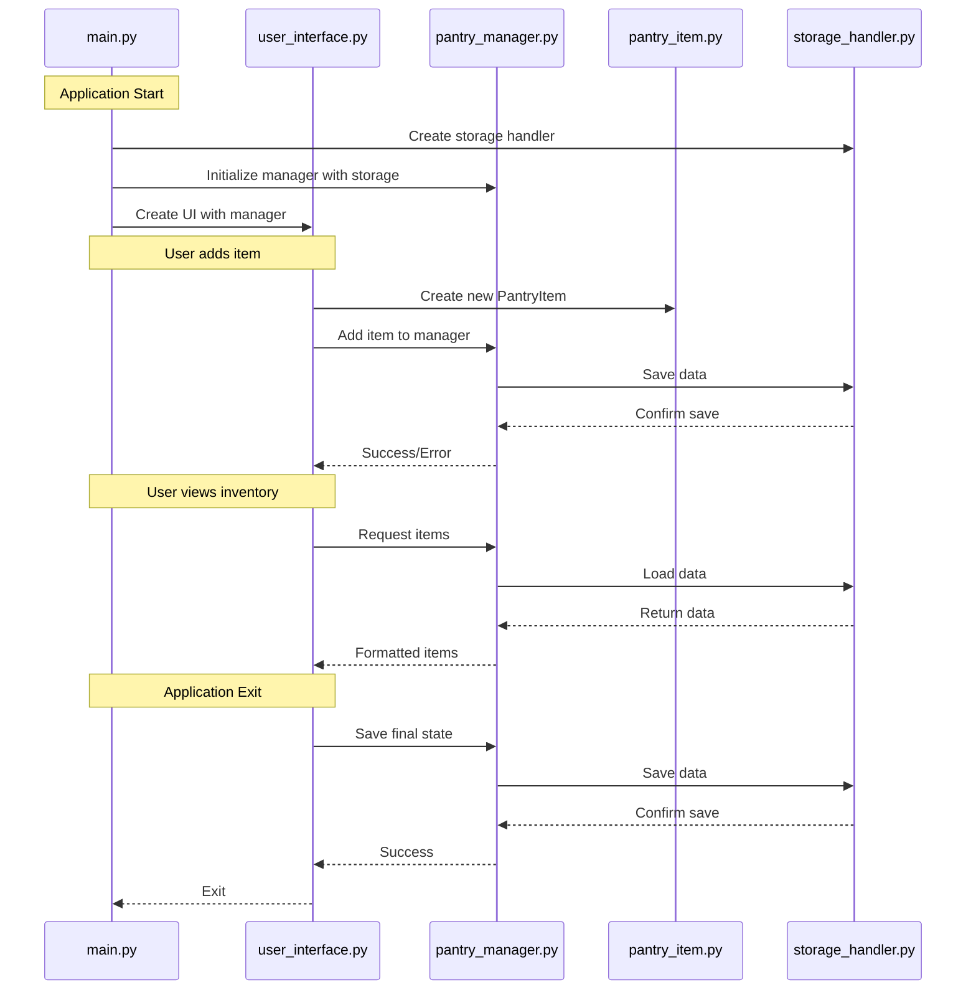

```mermaid
sequenceDiagram
    participant M as main.py
    participant UI as user_interface.py
    participant PM as pantry_manager.py
    participant PI as pantry_item.py
    participant SH as storage_handler.py
    
    Note over M: Application Start
    M->>SH: Create storage handler
    M->>PM: Initialize manager with storage
    M->>UI: Create UI with manager
    
    Note over M,UI: User adds item
    UI->>PI: Create new PantryItem
    UI->>PM: Add item to manager
    PM->>SH: Save data
    SH-->>PM: Confirm save
    PM-->>UI: Success/Error
    
    Note over M,UI: User views inventory
    UI->>PM: Request items
    PM->>SH: Load data
    SH-->>PM: Return data
    PM-->>UI: Formatted items
    
    Note over M,UI: Application Exit
    UI->>PM: Save final state
    PM->>SH: Save data
    SH-->>PM: Confirm save
    PM-->>UI: Success
    UI-->>M: Exit
```
