# Pantry Management System Documentation

## Table of Contents
1. System Overview
2. Component Architecture
3. Memory and Data Flow
4. Implementation Details
5. Code Examples and Usage

## 1. System Overview

### 1.1 Purpose
The Pantry Management System provides a way to track food items, their quantities, and expiration dates. The system ensures data integrity and provides persistent storage.

### 1.2 Separation of Concerns (SoC)
<summary>Component Responsibilities</summary>

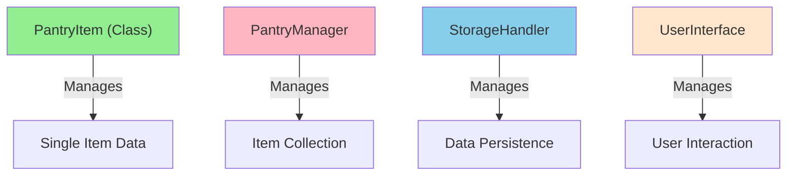

Each component has specific responsibilities:
- **PantryItem**: Manages individual item data and validation
- **StorageHandler**: Handles saving/loading data
- **PantryManager**: Manages collection of items
- **UserInterface**: Handles user interaction

## 2. Memory and Data Flow

### 2.1 Complete System Flow
<summary>Data Flow Through System</summary>

```mermaid
graph TD
    subgraph Creating New Item
        A[User Creates Item] -->|PantryItem class| B[New Object in RAM]
        B -->|to_dict| C[Dictionary in RAM]
        C -->|Storage Handler| D[Save to File]
    end

    subgraph Loading Existing Items
        E[Start App] -->|Storage Handler| F[Read File]
        F -->|Parse| G[Dictionary in RAM]
        G -->|from_dict| H[PantryItem Objects in RAM]
    end

    style B fill:#90EE90,stroke:#333,stroke-width:2px
    style H fill:#90EE90,stroke:#333,stroke-width:2px
    style C fill:#FFB6C1,stroke:#333,stroke-width:2px
    style G fill:#FFB6C1,stroke:#333,stroke-width:2px
    style D fill:#87CEEB,stroke:#333,stroke-width:2px
    style F fill:#87CEEB,stroke:#333,stroke-width:2px
```


### 2.2 Memory States
- **RAM (Active Memory)**:
  - PantryItem objects (during runtime)
  - Dictionary representations
  - Temporary calculations
- **File Storage (Persistent)**:
  - JSON or CSV format
  - Backup copies
  - Historical data

## 3. PantryItem Class Implementation

### 3.1 Class Structure
```python
class PantryItem:
    def __init__(self, name: str, ...):
        self._name = name  # Private attributes
        ...

    @property
    def name(self) -> str:  # Public interface
        return self._name
```

### 3.2 Data Protection Flow
<summary>Data Access Pattern</summary>

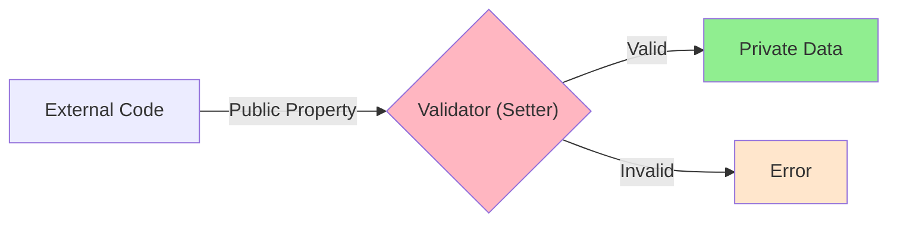

### 3.3 Data Transformation
<summary>Object-Dictionary Conversion</summary>

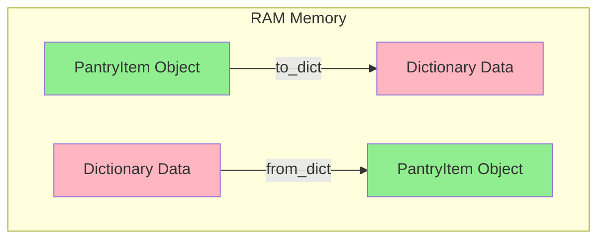


## 4. Implementation Details

### 4.1 Private Attributes and Properties
Private attributes are protected and accessed through properties:
```python
class PantryItem:
    def __init__(self):
        self._quantity = 0  # Private

    @property
    def quantity(self) -> float:
        return self._quantity  # Getter

    @quantity.setter
    def quantity(self, value: float):
        if value < 0:
            raise ValueError("Quantity cannot be negative")
        self._quantity = value  # Setter with validation
```

### 4.2 Object Representations
Two ways to represent PantryItems as strings:

| Method | Purpose | Example Output |
|--------|---------|---------------|
| `__str__` | User display | "Apple (5.0 pieces) - Expires: 2024-02-23" |
| `__repr__` | Debugging | "PantryItem(name='Apple', quantity=5.0)" |

### 4.3 Unique Identifiers
<summary>ID Generation Flow</summary>

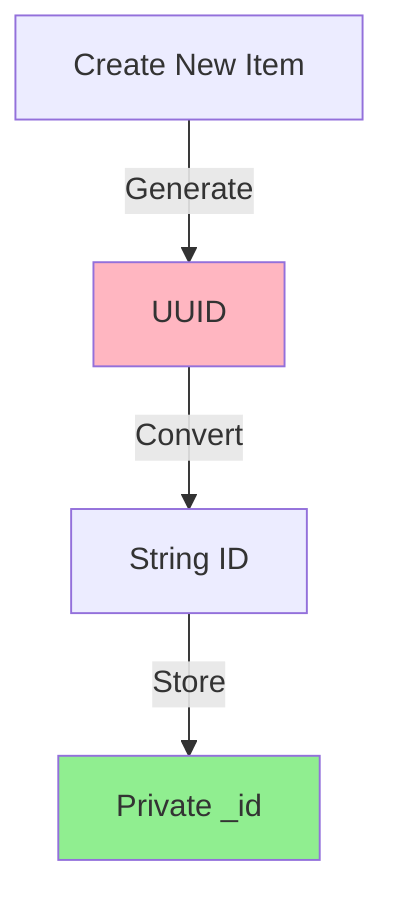

## 5. Data Storage

### 5.1 Storage Format Options
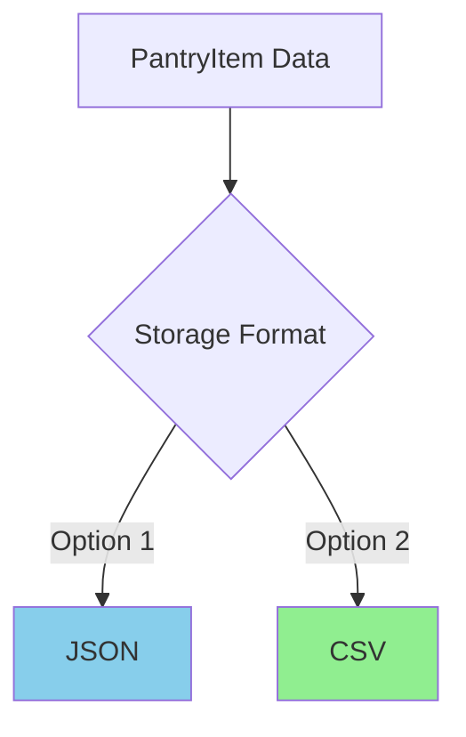

### 5.2 Memory to Storage Flow
<summary>Complete Storage Flow</summary>

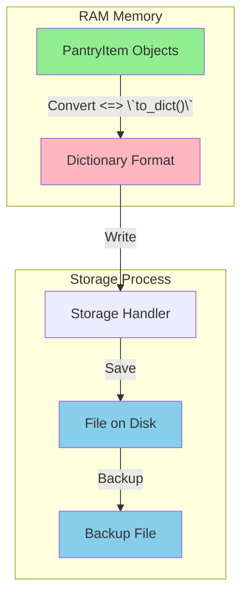


## 6. Error Handling and Validation

### 6.1 Validation Rules
- Quantity must be non-negative
- Expiry date must be valid datetime
- Required fields must not be empty

### 6.2 Error Flow
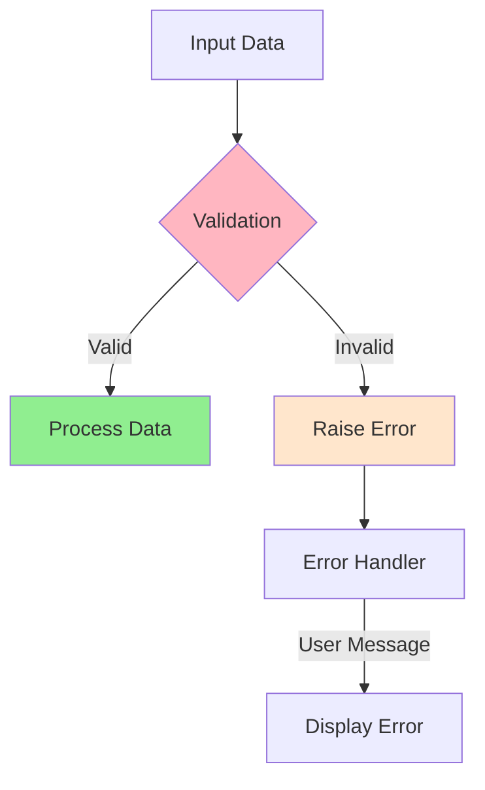

## 7. Testing Strategy

### 7.1 Test Categories
1. **Unit Tests**
   - Individual method behavior
   - Edge cases
   - Error conditions

2. **Integration Tests**
   - Object creation and modification
   - Data conversion
   - Storage operations

### 7.2 Test Structure
```python
class TestPantryItem(unittest.TestCase):
    def setUp(self):
        """Create test fixtures"""
        self.test_item = PantryItem(...)

    def test_validation(self):
        """Test data validation"""
        with self.assertRaises(ValueError):
            self.test_item.quantity = -1
```

## 8. Best Practices and Patterns

### 8.1 Separation of Concerns (SoC)
Each class has specific responsibilities:

| Component | Responsibility | Example |
|-----------|---------------|---------|
| PantryItem | Data structure | Manage single item |
| StorageHandler | Persistence | Save/load data |
| PantryManager | Business logic | Manage collections |
| UserInterface | User interaction | Display/input |

### 8.2 Design Patterns Used
1. **Property Pattern**
   - Control attribute access
   - Validate data changes
   - Maintain encapsulation

2. **Factory Pattern** (in `from_dict`)
   - Create objects from data
   - Handle conversion logic
   - Ensure valid objects

## 9. Usage Examples

### 9.1 Basic Usage
```python
# Create new item
apple = PantryItem(
    name="Apple",
    quantity=5.0,
    unit="pieces",
    expiry_date=datetime.now() + timedelta(days=7)
)

# Update quantity
apple.quantity = 3.0  # Goes through validation

# Convert to dictionary
data = apple.to_dict()
```

### 9.2 Complete Flow Example
```python
# Create and save item
item = PantryItem(name="Milk", ...)
manager.add_item(item)
manager.save_data()

# Load and use items
items = manager.get_items_by_category("Dairy")
expired = manager.get_expired_items()
```

## 10. Memory Management

### 10.1 RAM Usage
<summary>Memory Lifecycle</summary>

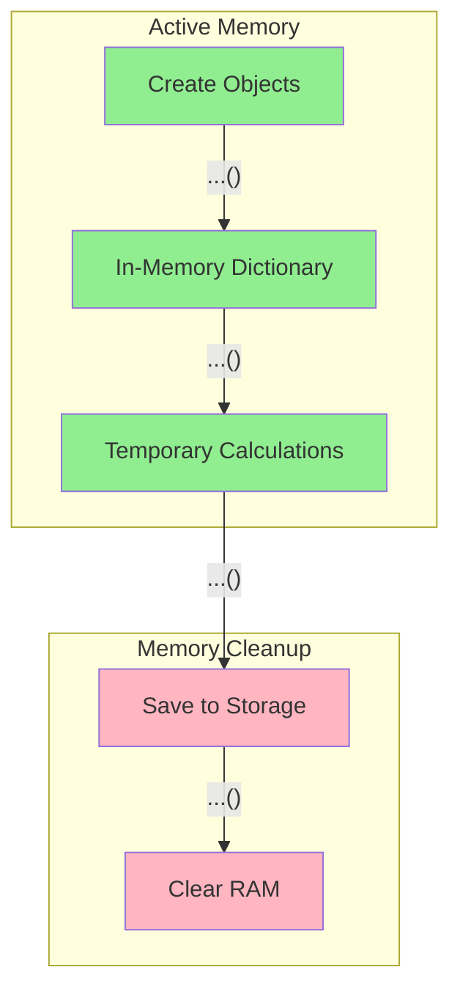

### 10.2 Resource Management
- Objects exist in RAM during runtime
- Garbage collection handles cleanup
- Storage handler manages persistence

## 11. System States and Transitions

### 11.1 Application States
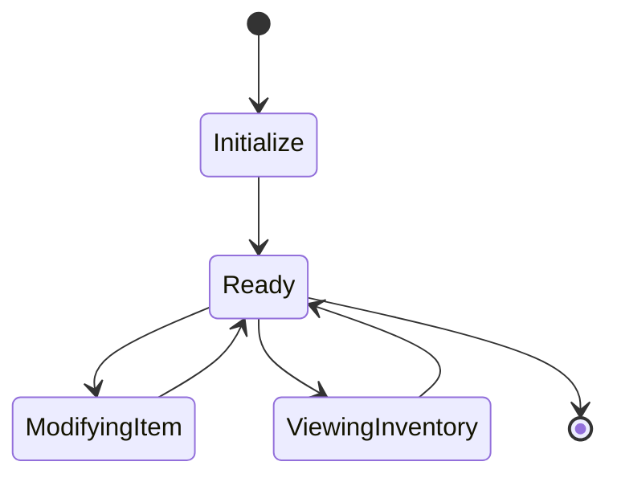

### 11.2 Data States
<summary>Data State Transitions</summary>

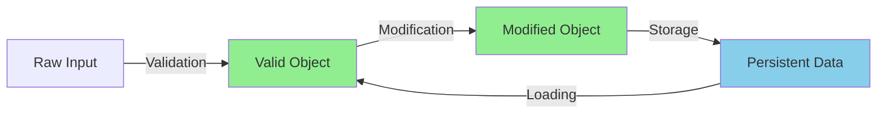


## 12. Performance Considerations

### 12.1 Time Complexity
| Operation | Complexity | Notes |
|-----------|------------|-------|
| Item Creation | O(1) | Direct object creation |
| Dictionary Conversion | O(1) | Fixed number of fields |
| Category Search | O(n) | Linear search through items |
| ID Generation | O(1) | UUID generation |

### 12.2 Space Complexity
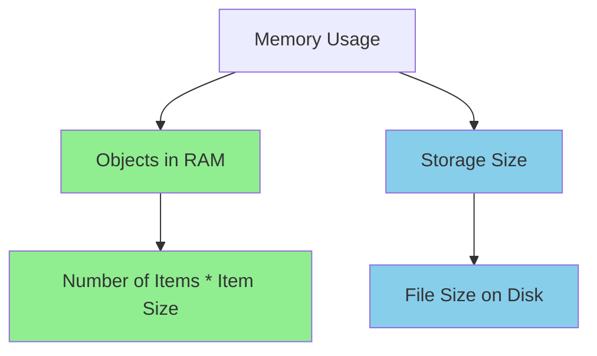

## 13. Extension Points

### 13.1 Adding New Features
```python
class PantryItem:
    def __init__(self):
        # Existing attributes
        self._name = name
        # New feature attributes
        self._location = None  # Optional shelf location
        self._notes = []      # Additional notes
```

### 13.2 Custom Validation
```python
@property
def location(self) -> Optional[str]:
    return self._location

@location.setter
def location(self, value: str):
    # Custom validation logic
    if not self._is_valid_location(value):
        raise ValueError("Invalid storage location")
    self._location = value
```

## 14. Troubleshooting Guide

### 14.1 Common Issues
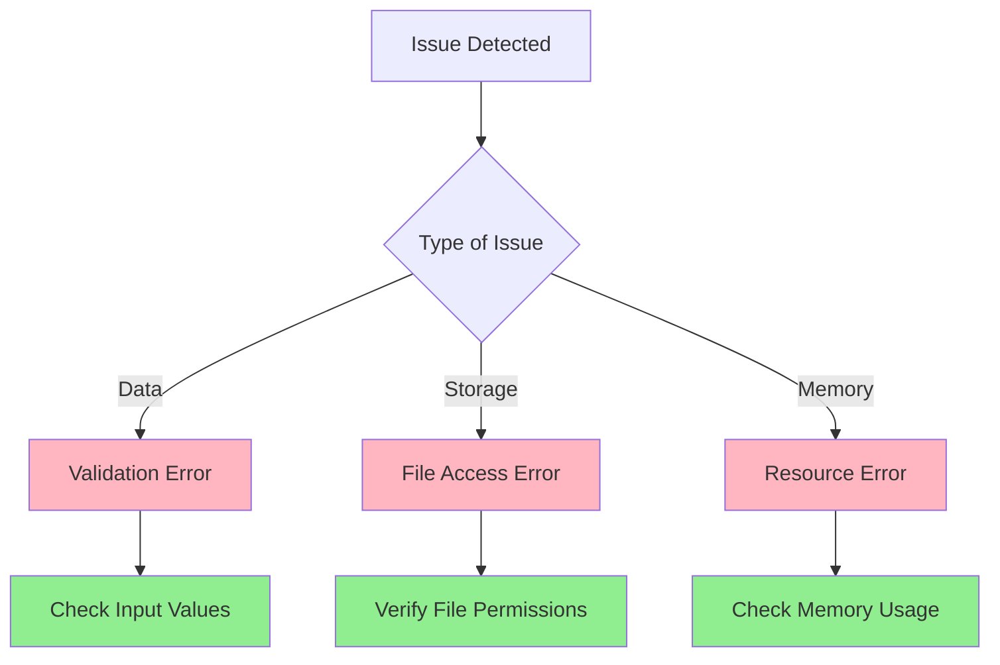

### 14.2 Debugging Strategies
1. **Object State**
   - Use `repr()` for detailed state
   - Check property values
   - Verify validations

2. **Storage Issues**
   - Check file permissions
   - Verify file format
   - Test backup/restore

## 15. Integration Guidelines

### 15.1 System Integration
<summary>Integration Points</summary>

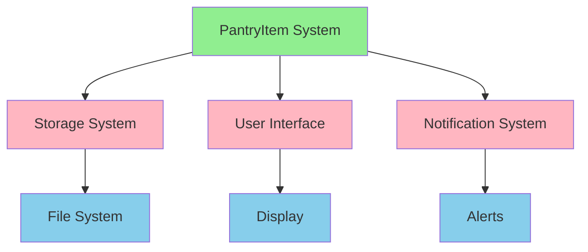

### 15.2 External Systems
- File system interactions
- User interface integration
- Notification systems
- Backup systems

## 16. Future Enhancements

### 16.1 Planned Features
1. **Category Management**
   - Hierarchical categories
   - Custom category attributes
   - Category-specific validation

2. **Advanced Search**
   - Full-text search
   - Complex queries
   - Search history

3. **Data Analytics**
   - Usage patterns
   - Expiry predictions
   - Inventory optimization
