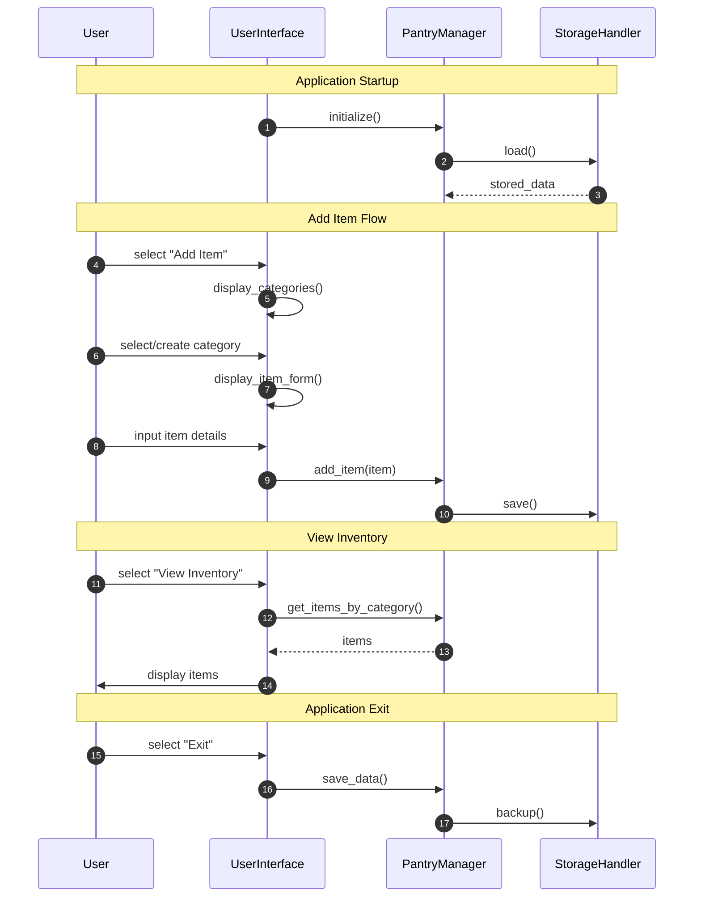

<h2>Description</h2>

<u>Application Startup Flow</u>

### When the app starts:

1. UserInterface initializes PantryManager
2. PantryManager requests data (fileName.csv) from StorageHandler
3. StorageHandler loads and returns stored data
- The app is now ready with user's previous inventory

<u>Add Item Flow</u>

### User initiates add item process

1. Shows available categories
2. Lets user select existing or create new category
3. Displays form for item details

### After user inputs details:

4. Data flows through UI → PantryManager → StorageHandler
5. StorageHandler saves the updated inventory

<u>View Inventory Flow</u>

### User requests to view inventory

1. UI requests items from PantryManager
2. PantryManager returns categorized items
3. UI displays organized inventory to user

<u>Application Exit Flow</u>

### User selects exit

1. UI triggers PantryManager to save
2. PantryManager tells StorageHandler to backup
3. Ensures data is safely stored and backed up

