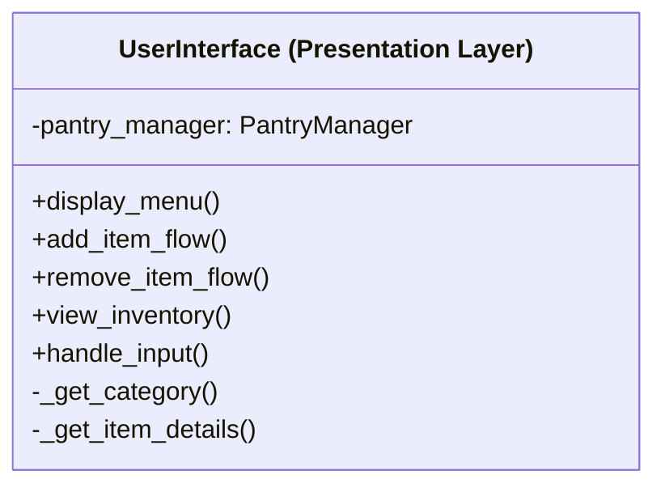

# UML Description

## User Interface (Presentation Layer)
### Questions I asked myself 🤔
- What will the user see upon start up?
- What is the first thing the user should do to fulfuil the purpose of the app?
- How can they resolve their own mistakes?
- How can they see what they've done?
- How can they navigate the app?

#### Symbols
- `-` means "private" (internal use only within the class)
    - Can't be accessed by other `class` and or `methods`
- `+` means "public" (can be accessed from outside the class)
    - `methods` that can be reused in other parts of the code

#### `attributes` (Private)
- `self.pantry_manager` an object value being able to access other `methods` `attributes` and various functionalities if needed.

#### `methods` *(Public)*
- `display_menu()`: Shows the main menu options to the user on start up.
- `add_item_flow()`: Handles the complete process of adding a new item. The essential and puspose of the app.
- `remove_item_flow()`: Handles the complete process of removing an item. Allowing the user to control their inventory with the remove function.
- `view_inventory()`: Shows the current inventory to the user. Being able to showcase their inventory in a user friendly interface design.
- `handle_input()`: Processes user input and directs it to appropriate actions. Navigation throughout the app via a list type UI and number option. ß

#### `methods` *(Private)* ("getter")
`_get_category()`: Internal helper method to get category information when adding an item *(Allowing the user to input information when prompted)*
`_get_item_details()`: Internal helper method to gather item details *(Allowing the user to input information when prompted)*