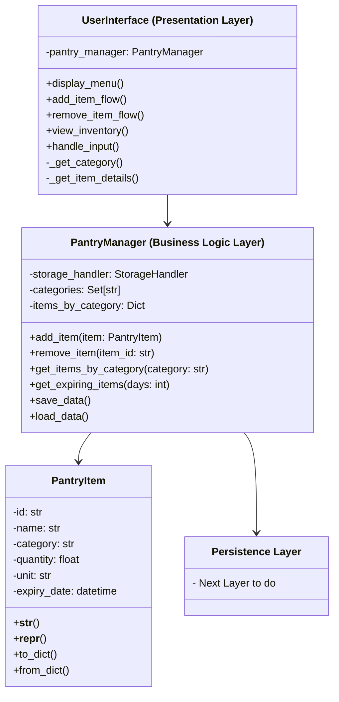

---

## UML Concept
---

### User Interface (Presentation Layer)
---

#### Questions I asked myself 🤔
- What will the user see upon start up?
- What is the first thing the user should do to fulfuil the purpose of the app?
- How can they resolve their own mistakes?
- How can they see what they've done?
- How can they navigate the app?

#### Symbols
- `-` means "private" (internal use only within the class)
    - Can't be accessed by other `class` and or `methods`
- `+` means "public" (can be accessed from outside the class)
    - `methods` that can be reused in other parts of the code

#### `attributes` *(Private)*
- `self.pantry_manager`
an object value being able to access other `methods` `attributes` and various functionalities if needed.

#### `methods` *(Public)*
- `display_menu()`
Shows the main menu options to the user on start up.
- `add_item_flow()`
Handles the complete process of adding a new item. The essential and purpose of the app.
- `remove_item_flow()`
Handles the complete process of removing an item. Allowing the user to control their inventory with the remove function.
- `view_inventory()`
Shows the current inventory to the user. Being able to showcase their inventory in a user friendly interface design.
- `handle_input()`
Processes user input and directs it to appropriate actions. Navigation throughout the app via a list type UI and number option. ß

#### `methods` *(Private)* ("getter")
- `_get_category()`
Internal helper method to get category information when adding an item *(Allowing the user to input information when prompted)*
- `_get_item_details()`
Internal helper method to gather item details *(Allowing the user to input information when prompted)*

---

### User Interface (Presentation Layer)

#### Questions I asked myself 🤔
- Allowing the user to choose from previously added categories to save on input time.
- When viewing your items having them sorted by category rather than a long list of items. (Viewable UI)
- Allow the user to save their data locally to their device (CSV file format)
- Get the app to restore their inventory data from the CSV file and also if there is corruption to restore from JSON file. 

###### *\ CSV => User Friendly \ \ JSON => Dev Friendly \\*

#### `attributes` *(Private)*
- `self.storage_handler = StorageHandler` 
an object value being able to access other `methods` `attributes` and various functionalities if needed that relate to storage (read/write) CSV/JSON File.
- `self.categories = Set[str]` 
A Set data structure to store unique categories. `set` structures are unique only meaning that there wont be duplicates which is important for categories. 
- `items_by_category: Dict` 
A dictionary method that allows the items to be organized by category rather than a long list of items. Easier to sort and maintain. 

#### `methods` *(Public)*
- `add_item(item: PantryItem)`
Takes a 'PantryItem'(`class`, this has all the attributes of item, quantity, exp, etc) object as an input. Then adds it to the appropriate category in `items_by_category`
- `remove_item(item_id: str)` 
Takes an item's unique identifier(ID) then removes that item from the `items_by_category` dictionary.
- `get_items_by_category(category: str)`
Returns all items in a specified category. This will be used to show the users inventory by category and its items. 
- `get_expiring_items(days: int)`
Returns items that will expire within the specified number of days. Showcase the amount of days till expiry of item. 
- `save_data()`
Used in conjunction with `storage_handler` that will store user input to a CSV file and restore. 
- `load_data()`
Uses `storage_handler` to load saved data from CSV. Restoring users inventory from local storage. This would be the first check to initiate if new file needs to be created or not. This may also initialize `items_by_category` if data is needed.

---

### PantryItem *(Package)*

#### Questions I asked myself 🤔
- What information does the user need to put in to save their items? (name, category, quantity, expiry date)

#### `attributes` *(Private)*
- `-id: str`
A unique identifier for each item. This will be used to update and or remove data.
- `-name: str`
The name of the item (e.g., "Apple", "Milk")
- `-category: str`
Which category this item belongs to (e.g., "Fruits", "Dairy")
- `-quantity: float`
Amount of the item
Using float allows for decimal quantities (e.g., 1.5 pounds)
- `-unit: str`
The measurement unit (e.g., "kg", "pieces", "liters")
- `-expiry_date: datetime`
When the item will expire
Using datetime type for proper date handling

#### `methods` *(Public)*
- `__str__()`
Python method for string representation. Used when printing the item for user display (`view_inventory`)
- `__repr__()` *[Troubleshooting]*
Python method for object representation
Used for debugging and development Returns a more detailed, technical representation
- `to_dict()` *[Serialization]*
Converts the `PantryItem` object's data to a dictionary format so it can be stored in CSV/JSON files.
Serialization means converting an object into a format that can be easily stored or transmitted.
- `from_dict()` *[Deserialization]*
Converts dictionary data (usually from stored CSV/JSON files) back into a `PantryItem` object so the app can work with it using object methods and attributes. 

---

### Local Database (Persistence Layer)